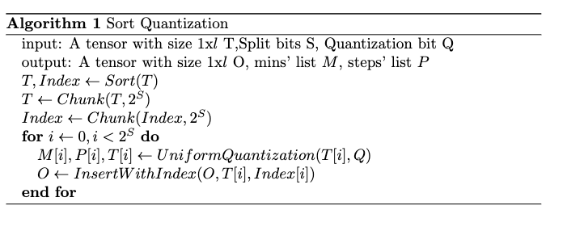
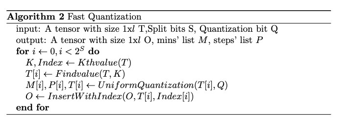
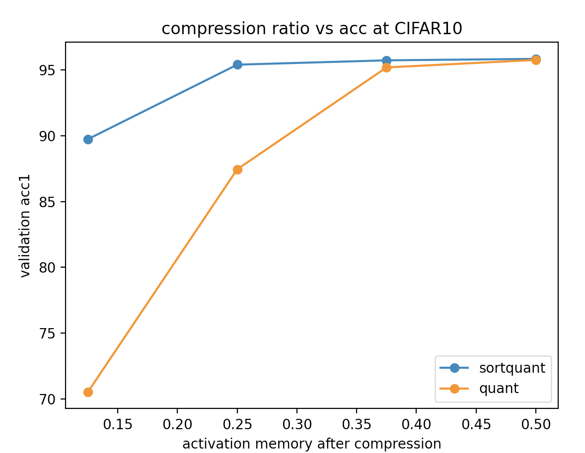
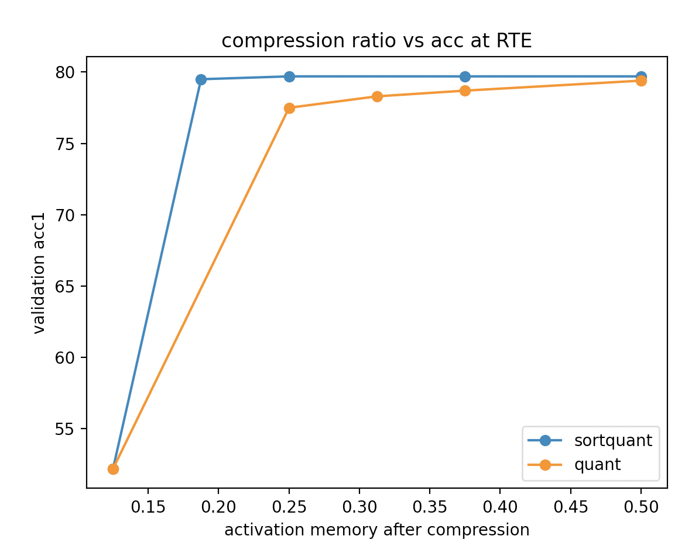

# Epipe: Efficient Pipeline Parallelism with compression algorithm

## Introduction

Parallelism Pipeline is a method to accelerate training speed by dividing batches into minibatches and training these batches parallely. Also, we try to use compression algorithms to compress activations and gradients being sent and received in order to save bandwidth and get better throughputs.

## Reference

1. Dataparallel tests of compression algorithm https://github.com/timmywanttolearn/gpipe_test/tree/master/dataparallel/compression_simulation
2. pipeline training in single machine with compression algorithm https://github.com/timmywanttolearn/gpipe_test/tree/master/pipeline_training
3. Modified gpipe for single machine https://github.com/timmywanttolearn/gpipe_test/tree/master/torchgpipe
4. Server version of pipeline parallelism https://github.com/timmywanttolearn/gpipe_test/tree/master/pipeline_server
5. Client version of pipeline parallelism https://github.com/timmywanttolearn/gpipe_test/tree/master/pipeline_client

# 1. Distributed Pipeline Parallelism Training

Parallelism Pipeline training efficiency compares to data-parallelism.

See code at https://github.com/timmywanttolearn/gpipe_test/tree/master/dataparallel/pipeline_vs_dataparallel

## 1.1 Vision Tasks

| Experiment                 | Dataset | Backend     | GPUs | Batch size    | Learning rate | Top-1 acc (%) | Throughput | Speed up |
| -------------------------- | ------- | ----------- | ---- | ------------- | ------------- | ------------- | ---------- | -------- |
| Dataparallel-2gpu          | CIFAR10 | MobilenetV2 | 2    | 64            | 0.005         | 95.83±0.04    | 376.47/s   | 1×       |
| Pipeline-2gpu              | CIFAR10 | MobilenetV2 | 2    | 64(4 chunks)  | 0.005         | 95.89±0.07    | 228.57/s   | 0.607×   |
| Pipeline-2gpu(origin code) | CIFAR10 | MobilenetV2 | 2    | 64(4 chunks)  | 0.005         | 95.87         | 213.33/s   | 0.566×   |
| Pipeline-4gpu              | CIFAR10 | MobilenetV2 | 4    | 256(4 chunks) | 0.02          | 96.03±0.14    | 400.30/s   | 1.07×    |
| Pipeline-4gpu(origin code) | CIFAR10 | MobilenetV2 | 4    | 256(4 chunks) | 0.005         | 95.89         | 419.67/s   | 1.11×    |
| Pipeline-4gpu              | CIFAR10 | MobilenetV2 | 4    | 256(8 chunks) | 0.02          | 96.07±0.05    | 397.30/s   | 1.06×    |
| Dataparallel-4gpu          | CIFAR10 | MobilenetV2 | 4    | 256           | 0.02          | 95.94±0.09    | 627.22/s   | 1.66×    |

## 1.2 NLP Tasks

| Experiment        | Dataset | Backend | GPUs | Batch size   | Learning rate | Top-1 acc (%) | Throughput | Speed up |
| ----------------- | ------- | ------- | ---- | ------------ | ------------- | ------------- | ---------- | -------- |
| Dataparallel-2gpu | RTE     | Roberta | 2    | 32           | 2e-5          | 79.0±0.27     | 76.19/s    | 1×       |
| Pipeline-2gpu     | RTE     | Roberta | 2    | 32(4 chunks) | 2e-5          | 78.59±0.21    | 61.53/s    | 0.80×    |
| Pipeline-2gpu     | RTE     | Roberta | 2    | 64(4 chunks) | 4e-5          | 77.56±0.39    | 68.82/s    | 0.90×    |
| Pipeline-4gpu     | RTE     | Roberta | 4    | 64(4 chunks) | 4e-5          | 78.17±0.44    | 106.40/s   | 1.40×    |
| Pipeline-4gpu     | RTE     | Roberta | 4    | 64(2 chunks) | 4e-5          | 78.15±0.22    | 96.40/s    | 1.27×    |
| Dataparallel-4gpu | RTE     | Roberta | 4    | 64           | 4e-5          | 78.4±0.21     | 95.53/s    | 1.25     |

We could conclude that Parallelism Pipeline is faster than dataparallel for big models such as Roberta-base.

# 2.Sort Quantization

We invented a fast method of quantization algorithm which has similar effect with k-means algorithms

Here is the pseudocode

## 2.1Ablation Study

Ablation Studys are performed by using pipeline parallelism.

### Settings For CIFAR10

| Epochs | Lr   | Batch Size | Scheduler | Optimizer |
| ------ | ---- | ---------- | --------- | --------- |
| 40     | 0.01 | 256        | Cosine    | SGD       |

### Settings For RTE

| Epochs | Lr   | Batch Size | Scheduler | Optimizer |
| ------ | ---- | ---------- | --------- | --------- |
| 20     | 2e-5 | 32         | Poly      | AdamW     |

## 2.2 Altogether Ablation Study

These tests are all done in the environment of parallelism pipeline.

### CIFAR10

Backend:MobileNetV2

Client-Server Partition: First and last layer

Chunk: 4

| Batchsize     | Activation Memory Size(al together) | Compression Method(default3:1) | Compression Ratio | Validation Acc |
| ------------- | ----------------------------------- | ------------------------------ | ----------------- | -------------- |
| 256(8 chunks) | [256,32,112,112] [256,1280,7,7]     | None                           | 1                 | 95.87%         |
| 256(8 chunks) | [256,32,112,112] [256,1280,7,7]     | Sort Quantization 16bits       | 0.5               | 95.84%         |
| 256(8 chunks) | [256,32,112,112] [256,1280,7,7]     | Sort Quantization 12bits       | 0.375             | 95.73%         |
| 256(8 chunks) | [256,32,112,112] [256,1280,7,7]     | Sort Quantization 8bits        | 0.25              | 95.68%         |
| 256(8 chunks) | [256,32,112,112] [256,1280,7,7]     | Sort Quantization 4bits        | 0.125             | 87.10%         |

### CIFAR100

Backend:MobileNetV2

Client Server Partition: First and last layer

Since the activation memory size is the same as the CIFAR10 dataset, the bandwidth is the same as the bandwidth in CIFAR10

| Batchsize     | Activation Memory Size(al together) | Compression Method(default3:1) | Compression Ratio | Validation Acc |
| ------------- | ----------------------------------- | ------------------------------ | ----------------- | -------------- |
| 256(8 chunks) | [256,32,112,112] [256,1280,7,7]     | No                             | 1                 | 80.92%         |
| 256(8 chunks) | [256,32,112,112] [256,1280,7,7]     | Sort Quantization 16bits       | 0.5               | 80.85%         |
| 256(8 chunks) | [256,32,112,112] [256,1280,7,7]     | Sort Quantization 12bits       | 0.375             | 80.61%         |
| 256(8 chunks) | [256,32,112,112] [256,1280,7,7]     | Sort Quantization 8bits        | 0.25              | 78.83%         |

### FOOD101

Backend:MobileNetV2

Client Server Partition: First and last layer

Since the activation memory size is the same as the CIFAR10 dataset, the bandwidth is the same as the bandwidth in CIFAR10

| Batchsize     | Activation Memory Size(al together) | Compression Method(default3:1) | Compression Ratio | Validation Acc |
| ------------- | ----------------------------------- | ------------------------------ | ----------------- | -------------- |
| 256(8 chunks) | [256,32,112,112] [256,1280,7,7]     | No                             | 1                 | 83.76%         |
| 256(8 chunks) | [256,32,112,112] [256,1280,7,7]     | Sort Quantization 16bits       | 0.5               | 83.77%         |
| 256(8 chunks) | [256,32,112,112] [256,1280,7,7]     | Sort Quantization 12bits       | 0.375             | 83.72%         |
| 256(8 chunks) | [256,32,112,112] [256,1280,7,7]     | Sort Quantization 8bits        | 0.25              |                |

### RTE

Backend:Roberta-base

Client Server Partition: First two and last two layers

| Batchsize    | activation memory size(al together) | Compression method(default3:1) | compression ratio | Validation acc(in cola is Matthew) |
| ------------ | ----------------------------------- | ------------------------------ | ----------------- | ---------------------------------- |
| 32(4 chunks) | [32,128,768],[32,128,768]           | None                           | 1                 | 78.9%                              |
| 32(4 chunks) | [32,128,768],[32,128,768]           | Sort Quantization 16bits       | 0.5               | 79.6%±0.18%                        |
| 32(4 chunks) | [32,128,768],[32,128,768]           | Sort Quantization 12bits       | 0.375             | 79.6%±0.20%                        |
| 32(4 chunks) | [32,128,768],[32,128,768]           | Sort Quantization 8bits        | 0.25              | 79.4%±0.21%                        |
| 32(4 chunks) | [32,128,768],[32,128,768]           | Sort Quantization 4bits        | 0.125             | 52.2%                              |

### COLA

Backend:Roberta-base

Client Server Partition: First two and last two layers

Since the activation memory size is the same as the RTE dataset, the bandwidth is the same as the bandwidth in RTE

| Batchsize    | Activation Memory Size(Al together) | Compression Method(default3:1) | Compression Ratio | Matthew's Corelation |
| ------------ | ----------------------------------- | ------------------------------ | ----------------- | -------------------- |
| 32(4 chunks) | [32,128,768],[32,128,768]           | Sort Quantization 16bits       | 0.5               | 64.5±0.48            |
| 32(4 chunks) | [32,128,768],[32,128,768]           | Sort Quantization 12bits       | 0.375             | 63.93±0.22           |
| 32(4 chunks) | [32,128,768],[32,128,768]           | Sort Quantization 8bits        | 0.25              | 63.20±0.12           |
| 32(4 chunks) | [32,128,768],[32,128,768]           | Sort Quantization 4bits        | 0.125             | 0                    |

# Github Repo

https://github.com/timmywanttolearn/fast_pytorch_kmeans

I modify the repo to allow the fast k-means to run on multiple devices.

https://github.com/KinglittleQ/torch-batch-svd

