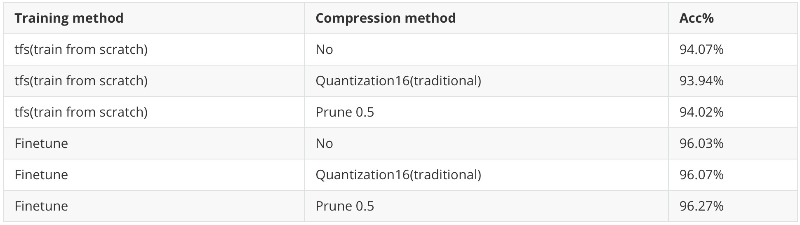
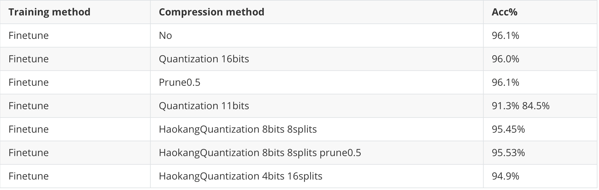
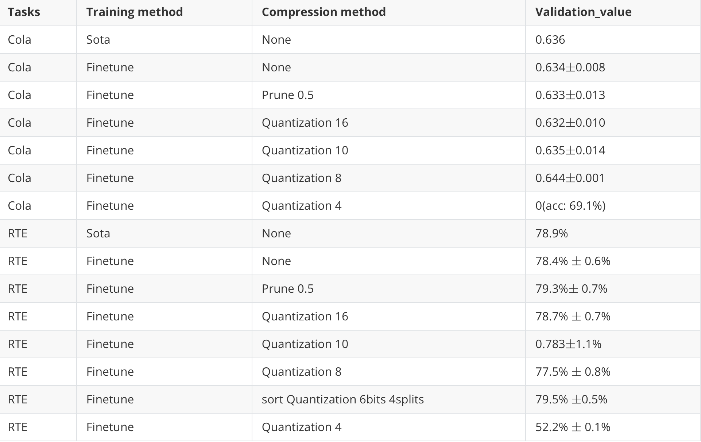

# TO DO LIST

## What I have done

### 1.distgpipe training

On CIFAR10 MobilenetV2 training

Traditional quantization is one step, one min per tensor. Multiple quantization has multiple steps and mins

Here are some important data. And I have done some train efficiency tests on dist-gpipe, which speed up the process at least 30%.



### 2.Dataparallel tests

I have trained 100epochs here.

On CIFAR10 MobilenetV2 training



The reason that quantization 11bits has two acc is that, it's curve first climb quickly like quantization 16bits but suddenly fall to 60% and then climb slowly.

On NLP tasks, for the cola dataset, I use Matthew's correlation. The rte dataset uses **validation acc**.



## To do

1. Finish multiple quantization in distributed method and run samples of CIFAR10 using MobileNetV2 backend.

   motivation: try this new method on the dist_gpipe system, test how many sets of steps and min are reasonable for **8bits** quantization

2. Fulfill the difference of input and output of quantization functions, record them and analyze.

   Motivation: analyze why the error will increase during small bits quantization training. And How to decrease it? Any specification that could represent the tensors distance that could give a response answer to acc decay dramatically.

3. Finish Roberta classification tasks using (prun ,quant,multiple quant) and analyze the results

   Motivation: tests compression layers on NLP tasks(don't prun nn.Embedding again).

# new method introduce

Haokang_quantization

Here is the pseudocode

```python
class HaokangQuantization(autograd.Function):
    @staticmethod
    def forward(ctx,input,bits,ratio,partition):
        shape = input.shape
        test = input
        input = input.view(-1)
        mask = torch.zeros(input.shape).to(input.get_device())
        src, index = torch.topk(torch.abs(input), int(ratio * input.shape[0]))
        # index and src to send 
        mask.index_fill_(0, index, 1.0)
        input = input * mask
        src = input.index_select(0,index)
        src1, index1 = torch.sort(src, dim = 0,descending=True)
        index1 = index1.chunk(partition)
        src1 = src1.chunk(partition)
        for i in range(partition):
            min, max = src1[i].min(),src1[i].max()
            if min != max:
                step = (max - min) / (pow(2, bits) - 1)
                temp_src = torch.round((src1[i] - min) / step) - pow(2, bits - 1)
                temp_src = (temp_src + pow(2, bits - 1)) * step + min
            else:
                temp_src = src1[i]
            src.scatter_(0,index1[i],temp_src)
        input.scatter_(0,index,src)
        ctx.mask = mask.view(shape)
        ctx.ratio = ratio
        ctx.bits = bits
        ctx.partition = partition
        input = input.view(shape)
        # if input.get_device() == 0:
        #     print("forward",torch.abs(torch.abs(input) - torch.abs(test)).sum()/torch.abs(test).sum())
        return input
    @staticmethod
    def backward(ctx,grad_backward):
        test = grad_backward
        shape = grad_backward.shape
        grad_backward = grad_backward * ctx.mask
        grad_backward = grad_backward.view(-1)
        index = grad_backward.nonzero()
        index = index.view(-1)
        src = grad_backward.index_select(0,index)
        src = src.view(-1)
        src1, index1 = torch.sort(src, dim = 0,descending=True)
        index1= index1.chunk(ctx.partition)
        src1 = src1.chunk(ctx.partition)
        for i in range(ctx.partition):
            min, max = src1[i].min(),src1[i].max()
            if min != max:
                step = (max - min) / (pow(2, ctx.bits) - 1)
                src_temp = torch.round((src1[i] - min) / step) - pow(2, ctx.bits - 1)
                src_temp = (src_temp + pow(2, ctx.bits - 1)) * step + min
            else:
                src_temp = src1[i]
            src.scatter_(0,index1[i],src_temp)
        grad_backward.scatter_(0,index,src)
        grad_backward = grad_backward.view(shape)
        return grad_backward,None,None,None
```


## TEST CODE

```
./tests/dataparallel_test_cv.py
```

