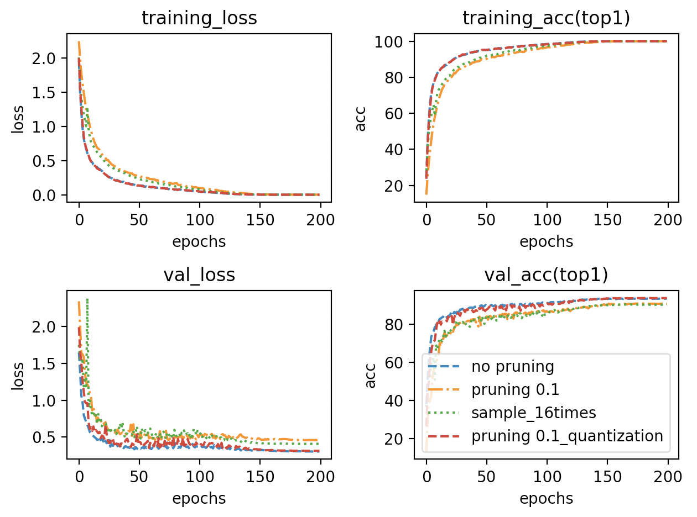
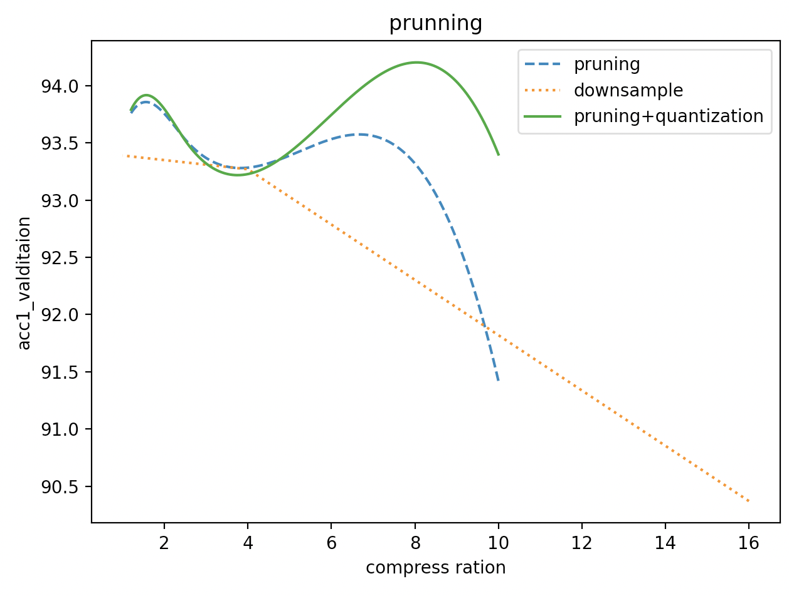

# Gpipe with compression tests

# Introductions and settings

Gpipe is a technique that built for model parallel. It separates batches to micro-batches and transfer them while computing.

Here is a test about some compression tests.

## Settings

| Model             | MobileNetV2                                  |
| ----------------- | -------------------------------------------- |
| Dataset           | CIFAR10                                      |
| Training_strategy | train from scratch                           |
| lr_init           | 0.4                                          |
| Batch_size        | 1024                                         |
| Chunk             | 4(every batch is splited to 4 micro batches) |
| Optimizer         | SGD                                          |
| Momentum          | 0.9                                          |
| Weight_decay      | 1e-4                                         |
| Epochs            | 200                                          |
| Scheduler         | cosannealing with linear warp up(20 epochs)  |
| Pruning methods   | topk pruning, downsample,quantization        |

## Results

Here are some important points, when acc suddenly decrease. For top pruning, when only 10% of output are sent, accuracy decrease about 2%. However, quantization will help it decrease, which is inferred at the paper. For downsample, when the compress ratio is 16(which means output is 8*8), accuracy decrease by about 3%.

Now here are some details about compress ratio and accuracy at validation datasets

