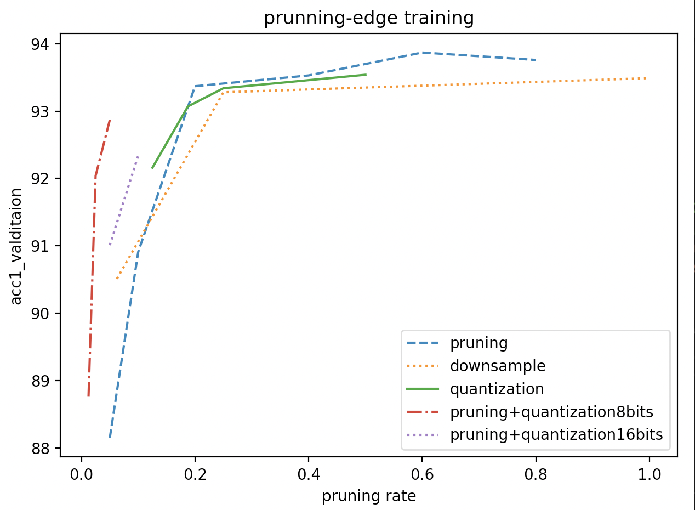

# Gpipe with compression tests

# Introductions and settings

Gpipe is a technique built for model parallel. It separates batches into micro-batches and transfers them while computing.

Here is a test about some compression tests.

## Settings

| Model             | MobileNetV2                                  |
| ----------------- | -------------------------------------------- |
| Dataset           | CIFAR10                                      |
| Training_strategy | train from scratch                           |
| lr_init           | 0.4                                          |
| Batch_size        | 1024                                         |
| Chunk             | 4(every batch is splited to 4 micro-batches) |
| Optimizer         | SGD                                          |
| Momentum          | 0.9                                          |
| Weight_decay      | 1e-4                                         |
| Epochs            | 200                                          |
| Scheduler         | cosannealing with linear warp up(20 epochs)  |
| Pruning methods   | topk pruning, downsample, quantization       |

## Results


pruning rate(input_pruning/input_before_pruning) vs validation_acc1




It shows that when at the same pruning rate(compression rate), using both pruning and quantization is better than any other choices provided.

Also, there are some interesting phenomenons.

First, quantization may increase accuracy when using pruning. In the graph, we could see that when at pruning 0.1 and pruning 0.05, using quantization 8 and quantization 16 are better than origin pruning 0.1 or pruning 0.05. However, this only happens in the condition that the pruning rate is high. For pruning 0.2 or pruning 0.4, it does not happen.


Second, only using quantization will cause a huge overfit during training.


However, when using topk pruning together, the curve does not tremble that much. 


# code

### quantization

https://github.com/timmywanttolearn/gpipe_test/blob/master/code/distributed_layers.py#:~:text=class%20QuantFunction(autograd,return%20output%2C%20None

### topk_pruning

https://github.com/timmywanttolearn/gpipe_test/blob/master/code/distributed_layers.py#:~:text=class%20Topk(nn,grad_output%20*%20self.mask

### partition method

https://github.com/timmywanttolearn/gpipe_test/blob/master/code/utils.py#:~:text=def%20make_partition(model,return%20partition

# different layers

Accuracy about different separation

|      | pruning0.1 | pruning0.2+quantization8 |
| ---- | ---------- | ------------------------ |
| 1:-1 | 90.88      | 92.17                    |
| 2:-2 | 93.63      | 91.77                    |
| 2:-1 | 93.06      | 91.72                    |
| 1:-2 | 92.57      | 90.95                    |

# Usage

```bash
python train.py ./data -logdir ./log/xxx.txt
```

