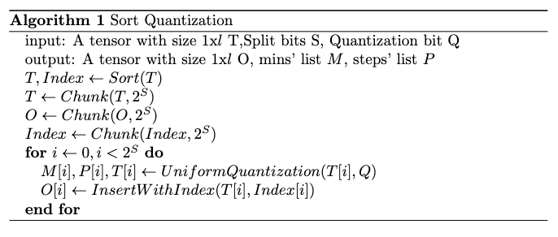
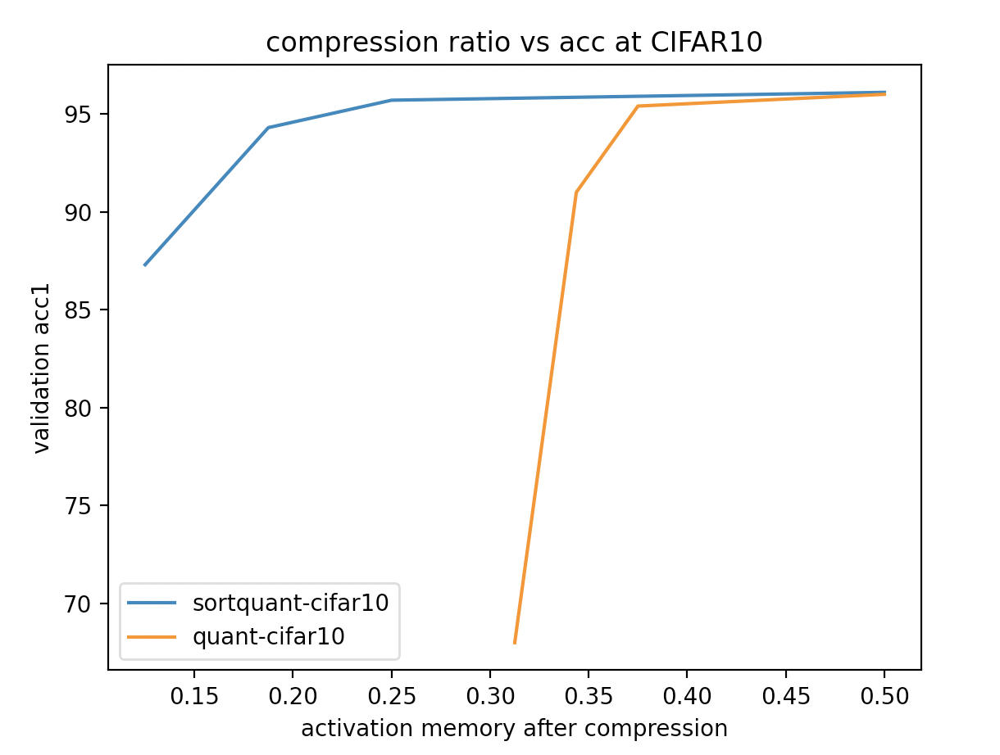
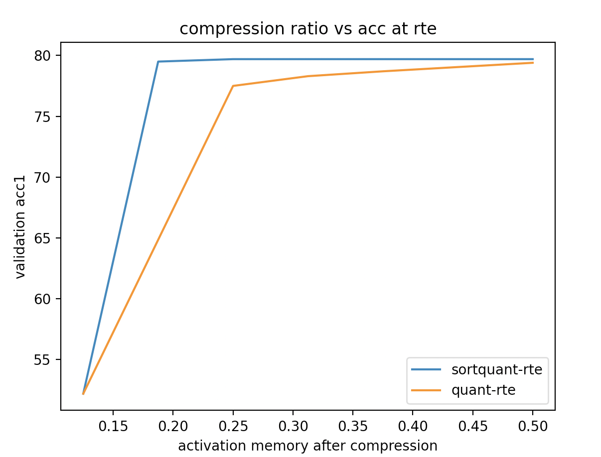

# 1.distgpipe training

Gpipe training efficiency compares to data-parallelism.

| Experiment                 | Dataset | Backend     | GPUs | Batch size    | Learning rate | Top-1 acc (%) | Throughput | Speed up |
| -------------------------- | ------- | ----------- | ---- | ------------- | ------------- | ------------- | ---------- | -------- |
| Pipeline-2gpu              | CIFAR10 | MobilenetV2 | 2    | 64(4 chunks)  | 0.005         | 95.89±0.07    | 228.57/s   | 0.607×   |
| Pipeline-2gpu(origin code) | CIFAR10 | MobilenetV2 | 2    | 64(4 chunks)  | 0.005         | None          | 213.33/s   | 0.566×   |
| Dataparallel-2gpu          | CIFAR10 | MobilenetV2 | 2    | 64            | 0.005         | 95.83±0.04    | 376.47/s   | 1×       |
| Pipeline-4gpu              | CIFAR10 | MobilenetV2 | 4    | 256(4 chunks) | 0.02          | 96.03±0.14    | 400.30/s   | 1.07×    |
| Pipeline-4gpu(origin code) | CIFAR10 | MobilenetV2 | 4    | 256(4 chunks) | 0.005         | None          | 419.67/s   | 1.11×    |
| Pipeline-4gpu              | CIFAR10 | MobilenetV2 | 4    | 256(8 chunks) | 0.02          | 96.07±0.05    | 397.30/s   | 1.06×    |
| Dataparallel-4gpu          | CIFAR10 | MobilenetV2 | 4    | 256           | 0.02          | 95.94±0.09    | 627.22/s   | 1.66×    |
| Pipeline-2gpu              | RTE     | Roberta     | 2    | 32(4 chunks)  | 2e-5          | 78.59±0.21    | 61.53/s    | 0.80×    |
| Pipeline-2gpu              | RTE     | Roberta     | 2    | 64(4 chunks)  | 4e-5          | 77.56±0.39    | 68.82/s    | 0.90×    |
| Dataparallel-2gpu          | RTE     | Roberta     | 2    | 32            | 2e-5          | 79.0±0.27     | 76.19/s    | 1×       |
| Pipeline-4gpu              | RTE     | Roberta     | 4    | 64(4 chunks)  | 4e-5          | 78.17±0.44    | 106.40/s   | 1.40×    |
| Pipeline-4gpu              | RTE     | Roberta     | 4    | 64(2 chunks)  | 4e-5          | 78.15±0.22    | 96.40/s    | 1.27×    |
| Dataparallel-4gpu          | RTE     | Roberta     | 4    | 64            | 4e-5          | 78.4±0.21     | 95.53/s    | 1.25     |

# 2.Sort Quantization

Haokang_quantization

Here is the pseudocode




## 2.1Ablation study







## 2.2Altogether Ablation Study

### CIFAR10

Backend:MobileNetV2

Client Server Partition: First and last layer

| Batchsize     | Activation Memory Size(al together) | Compression Method(default3:1) | Compression Ratio | Validation Acc | Bandwidth |
| ------------- | ----------------------------------- | ------------------------------ | ----------------- | -------------- | --------- |
| 256(8 chunks) | [256,32,112,112] [256,1280,7,7]     | Sort Quantization 16bits       | 0.5               | 96.0%±0.13%    |           |
| 256(8 chunks) | [256,32,112,112] [256,1280,7,7]     | Sort Quantization 12bits       | 0.375             | 95.9%±0.14%    |           |
| 256(8 chunks) | [256,32,112,112] [256,1280,7,7]     | Sort Quantization 8bits        | 0.25              | 95.7%±0.03%    |           |
| 256(8 chunks) | [256,32,112,112] [256,1280,7,7]     | Sort Quantization 4bits        | 0.125             | 87.10%         |           |

### CIFAR100

Backend:MobileNetV2

Client Server Partition: First and last layer

Since the activation memory size is the same as the CIFAR10 dataset, the bandwidth is the same as the bandwidth in CIFAR10

| Batchsize     | Activation Memory Size(al together) | Compression Method(default3:1) | Compression Ratio | Validation Acc |
| ------------- | ----------------------------------- | ------------------------------ | ----------------- | -------------- |
| 256(8 chunks) | [256,32,112,112] [256,1280,7,7]     | No                             | 1                 | 80.92%         |
| 256(8 chunks) | [256,32,112,112] [256,1280,7,7]     | Sort Quantization 16bits       | 0.5               | 80.85%         |
| 256(8 chunks) | [256,32,112,112] [256,1280,7,7]     | Sort Quantization 12bits       | 0.375             | 80.61%         |
| 256(8 chunks) | [256,32,112,112] [256,1280,7,7]     | Sort Quantization 8bits        | 0.25              | 78.83%         |

### FOOD101

Backend:MobileNetV2

Client Server Partition: First and last layer

Since the activation memory size is the same as the CIFAR10 dataset, the bandwidth is the same as the bandwidth in CIFAR10

| Batchsize     | Activation Memory Size(al together) | Compression Method(default3:1) | Compression Ratio | Validation Acc |
| ------------- | ----------------------------------- | ------------------------------ | ----------------- | -------------- |
| 256(8 chunks) | [256,32,112,112] [256,1280,7,7]     | No                             | 1                 | 83.76%         |
| 256(8 chunks) | [256,32,112,112] [256,1280,7,7]     | Sort Quantization 16bits       | 0.5               | 83.77%         |
| 256(8 chunks) | [256,32,112,112] [256,1280,7,7]     | Sort Quantization 12bits       | 0.375             | 83.72%         |
| 256(8 chunks) | [256,32,112,112] [256,1280,7,7]     | Sort Quantization 8bits        | 0.25              |                |

### RTE

Backend:Roberta-base

Client Server Partition: First two and last two layers

| Batchsize    | activation memory size(al together) | Compression method(default3:1) | compression ratio | Validation acc(in cola is Matthew) | Bandwidth |
| ------------ | ----------------------------------- | ------------------------------ | ----------------- | ---------------------------------- | --------- |
| 32(4 chunks) | [32,128,768],[32,128,768]           | Sort Quantization 16bits       | 0.5               | 79.6%±0.18%                        |           |
| 32(4 chunks) | [32,128,768],[32,128,768]           | Sort Quantization 12bits       | 0.375             | 79.6%±0.20%                        |           |
| 32(4 chunks) | [32,128,768],[32,128,768]           | Sort Quantization 8bits        | 0.25              | 79.4%±0.21%                        |           |
| 32(4 chunks) | [32,128,768],[32,128,768]           | Sort Quantization 4bits        | 0.125             | 52.2%                              |           |

### COLA

Backend:Roberta-base

Client Server Partition: First two and last two layers

| Batchsize    | Activation Memory Size(Al together) | Compression Method(default3:1) | Compression Ratio | Matthew's Corelation |
| ------------ | ----------------------------------- | ------------------------------ | ----------------- | -------------------- |
| 32(4 chunks) | [32,128,768],[32,128,768]           | Sort Quantization 16bits       | 0.5               | 64.5±0.48            |
| 32(4 chunks) | [32,128,768],[32,128,768]           | Sort Quantization 12bits       | 0.375             | 63.93±0.22           |
| 32(4 chunks) | [32,128,768],[32,128,768]           | Sort Quantization 8bits        | 0.25              | 63.20±0.12           |
| 32(4 chunks) | [32,128,768],[32,128,768]           | Sort Quantization 4bits        | 0.125             | 0                    |


| Dataset  | Backend     | Batchsize     | activation memory size(al together) | Compression method(default3:1) | compression ratio | Validation acc(in cola is Matthew) | Bandwidth          |
| -------- | ----------- | ------------- | ----------------------------------- | ------------------------------ | ----------------- | ---------------------------------- | ------------------ |
| CIFAR10  | MobileNetV2 | 256(8 chunks) | [256,32,112,112] [256,1280,7,7]f1l1 | Sort Quantization 16bits       | 0.5               | 96.0%±0.13%                        | 160.73G/s 25.94G/s |
| CIFAR10  | MobileNetV2 | 256(8 chunks) | [256,32,112,112] [256,1280,7,7]     | Sort Quantization 12bits       | 0.375             | 95.9%±0.14%                        | 131.41G/s 17.97G/s |
| CIFAR10  | MobileNetV2 | 256(8 chunks) | [256,32,112,112] [256,1280,7,7]     | Sort Quantization 8bits        | 0.25              | 95.7%±0.03%                        | 89.51G/s 13.03G/s  |
| CIFAR10  | MobileNetV2 | 256(8 chunks) | [256,32,112,112] [256,1280,7,7]     | Sort Quantization 4bits        | 0.125             | 87.10%                             | 37.13G/s 6.51G/s   |
| CIFAR100 | MobileNetV2 | 256(8 chunks) | [256,32,112,112] [256,1280,7,7]     | No                             | 1                 | 80.92%                             |                    |
| CIFAR100 | MobileNetV2 | 256(8 chunks) | [256,32,112,112] [256,1280,7,7]     | Sort Quantization 16bits       | 0.5               | 80.85%                             |                    |
| CIFAR100 | MobileNetV2 | 256(8 chunks) | [256,32,112,112] [256,1280,7,7]     | Sort Quantization 12bits       | 0.375             | 80.61%                             |                    |
| CIFAR100 | MobileNetV2 | 256(8 chunks) | [256,32,112,112] [256,1280,7,7]     | Sort Quantization 8bits        | 0.25              | 78.83%                             |                    |
| CIFAR100 | MobileNetV2 | 256(8 chunks) | [256,32,112,112] [256,1280,7,7]     | Sort Quantization 8bits(1:1)   | 0.25              | 80.52%                             |                    |
| Food101  | MobileNetV2 | 256(8 chunks) | [256,32,112,112] [256,1280,7,7]     | No                             | 1                 | 83.76%                             |                    |
| Food101  | MobileNetV2 | 256(8 chunks) | [256,32,112,112] [256,1280,7,7]     | Sort Quantization 16bits       | 0.5               | 83.77%                             |                    |
| Food101  | MobileNetV2 | 256(8 chunks) | [256,32,112,112] [256,1280,7,7]     | Sort Quantization 12bits       | 0.375             | 83.72%                             |                    |
| Food101  | MobileNetV2 | 256(8 chunks) | [256,32,112,112] [256,1280,7,7]     | Sort Quantization 8bits        | 0.25              |                                    |                    |
| RTE      | Roberta     | 32(4 chunks)  | [32,128,768],[32,128,768]f2l2       | Sort Quantization 16bits       | 0.5               | 79.6%±0.18%                        | 11.04G/s           |
| RTE      | Roberta     | 32(4 chunks)  | [32,128,768],[32,128,768]           | Sort Quantization 12bits       | 0.375             | 79.6%±0.20%                        | 8.19G/s            |
| RTE      | Roberta     | 32(4 chunks)  | [32,128,768],[32,128,768]           | Sort Quantization 8bits        | 0.25              | 79.4%±0.21%                        | 5.37G/s            |
| RTE      | Roberta     | 32(4 chunks)  | [32,128,768],[32,128,768]           | Sort Quantization 4bits        | 0.125             | 52.2%                              | 2.774G/s           |
| Cola     | Roberta     | 32(4 chunks)  | [32,128,768],[32,128,768]f2l2       | Sort Quantization 16bits       | 0.5               | 64.5±0.48                          | 11.33G/s           |
| Cola     | Roberta     | 32(4 chunks)  | [32,128,768],[32,128,768]           | Sort Quantization 12bits       | 0.375             | 63.93±0.22                         | 7.96G/s            |
| Cola     | Roberta     | 32(4 chunks)  | [32,128,768],[32,128,768]           | Sort Quantization 8bits        | 0.25              | 63.20±0.12                         | 5.91G/s            |
| Cola     | Roberta     | 32(4 chunks)  | [32,128,768],[32,128,768]           | Sort Quantization 4bits        | 0.125             | 0                                  | 2.65G/s            |

**Bandiwidth** is calculated by recv_bytes / recv_time

Also, bandwidth has a linear relationship with recv size.TEST CODE

```
python test_vision_dgpipe.py --sortquant --quant <quant bit> --split <split bit> --log <logdir> --chunk <chunk>
python test_nlp_dgpipe.py --sortquant --quant <quant bit> --split <split bit> --log <logdir> --chunk <chunk>
```

  for bandwidth detection, check 

```
./test_cv_bandwidth.py --bandwidth
./test_nlp_bandwidth.py --bandwidth
```

