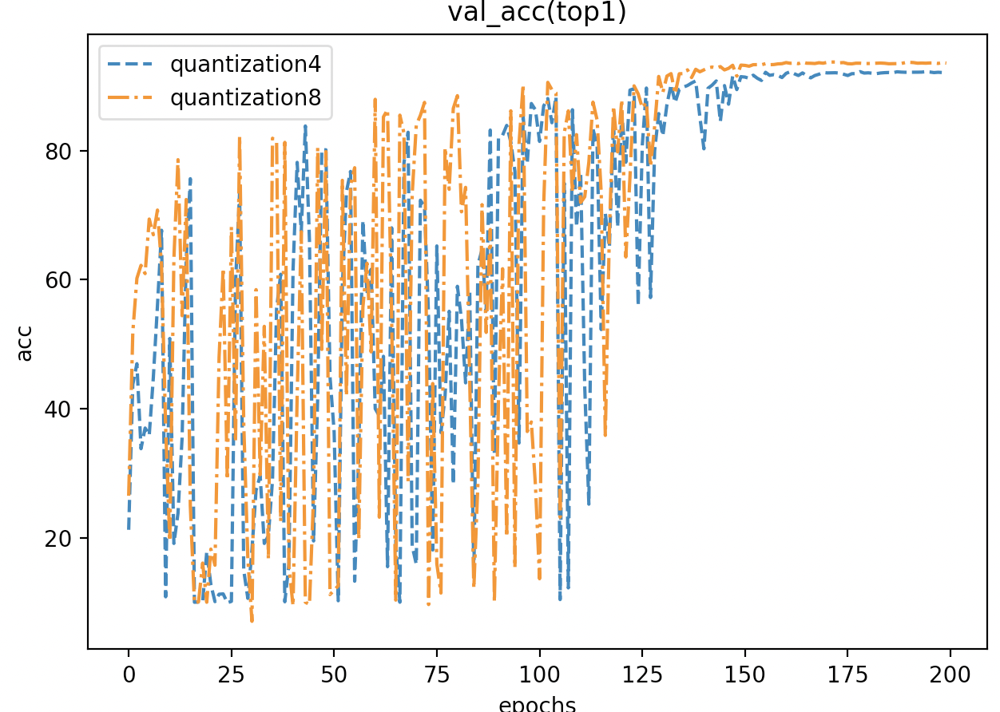
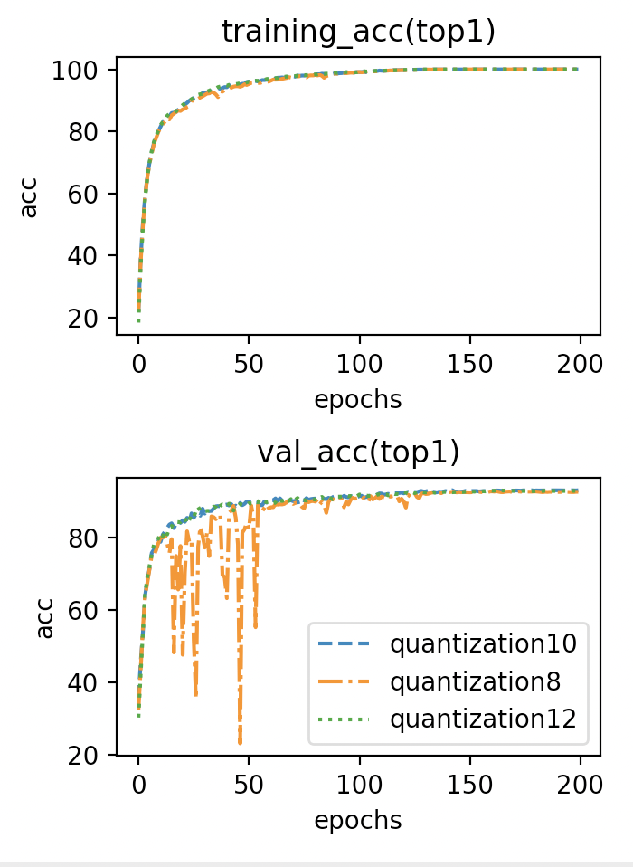
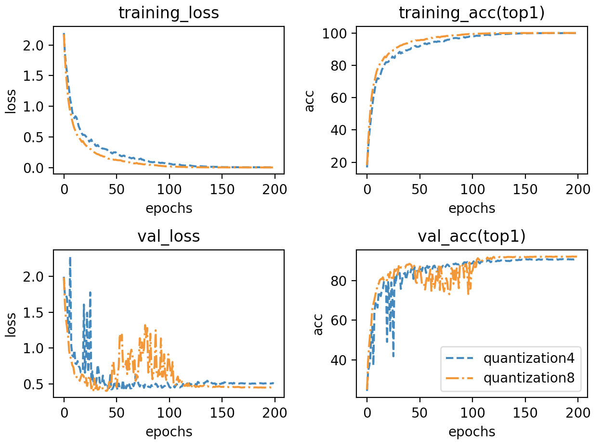
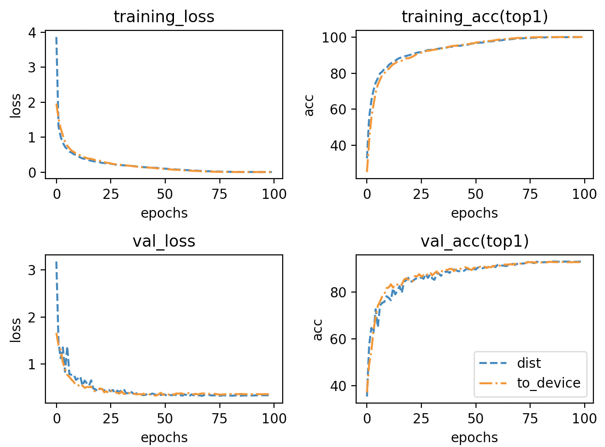

---

typora-copy-images-to: ./pic
---

# Test of different layers in edge

# Introductions and settings

I use gpipe to test different layers at the edge side.

## Settings

| Model             | MobileNetV2                                  |
| ----------------- | -------------------------------------------- |
| Dataset           | CIFAR10                                      |
| Training_strategy | train from scratch                           |
| lr_init           | 0.4                                          |
| Batch_size        | 1024                                         |
| Chunk             | 4(every batch is splited to 4 micro-batches) |
| Optimizer         | SGD                                          |
| Momentum          | 0.9                                          |
| Weight_decay      | 1e-4                                         |
| Epochs            | 200                                          |
| Scheduler         | cosannealing with linear warp up(20 epochs)  |
| Pruning methods   | pruning0.1                                   |

## Results

| layers at edge side     | val_acc1% |
| ----------------------- | --------- |
| first 1 + last 1 layers | 92.14     |
| first 2 +last 1 layers  | 92.22     |
| first 3 +last 1 layers  | 92.63     |
| first 1 +last 2 layers  | 90.84     |
| first 2 +last 2 layers  | 91.69     |
| First3 + last 2 layers  | 92.59     |
| first 1 +last 3 layers  | 91.12     |
| first 2 + last3 layers  | 91.72     |
| first 3 +last 3 layers  | 92.85     |

It shows that the more front layers are at the edge, the more accuracy the model gets. Also, when we put more posterior layers at the edge, the accuracy seems to get lower(since the posterior layers suffer compression two times).

## code


# About quantization

## Settings

The same as above.

## Result and discussion

Last week I found that in big learning rate conditions, quantization performs bad.



The picture shows above. 

However, when I try to decrease the learning rate to half of the original settings(0.2 for 1024 images per batch), this condition gets better.



Things get better.

Also when I change the learning rate to 0.1,quantization4 and quantization8 validation curve thresh only a little.



# A dist-gpipe test

## Settings

| Model             | MobileNetV2                                  |
| ----------------- | -------------------------------------------- |
| Dataset           | CIFAR10                                      |
| Training_strategy | train from scratch                           |
| lr_init           | 0.4                                          |
| Batch_size        | 1024                                         |
| Chunk             | 4(every batch is splited to 4 micro-batches) |
| Optimizer         | SGD                                          |
| Momentum          | 0.9                                          |
| Weight_decay      | 1e-4                                         |
| Epochs            | 100                                          |
| Scheduler         | cosannealing with linear warp up(20 epochs)  |
| Pruning methods   | No                                           |

I have implemented a dist-gpipe and tested it. It could get the same accuracy as Gpipe(to_device type). However, it costs too much both on memory(almost 1.5 times) and efficiency(almost 1.2 times). I am trying to correct it.

## Result



|               | Naive  | To_device | Dist   |
| ------------- | ------ | --------- | ------ |
| Val_acc1%     | 93.24  | 92.85     | 93.11  |
| Time(4chunks) | 2.53s  | 1.03s     | 2.09s  |
| Memory(peak)  | 13.27G | 9.32G     | 13.44G |


## Code

https://github.com/timmywanttolearn/gpipe_test/blob/fd4db565f1e7b49ffa412037f883c676fcd851f9/code/my_pipe/utils_gpipe.py#L36

still not a api，because I want to do some optimization about it.

## How to use

please download dataset first!

gpipe_train.py is in .code/gpipe_train.py

```
python3 gpipe_train.py ./data -logdir /gpipe_quant8_1024_4chunks_lr0.1.txt --train-type cloud+quantization --scalar 8 --lr 0.1;
python3 gpipe_train.py ./data -logdir /gpipe_quant4_1024_4chunks_lr0.1.txt --train-type cloud+quantization --scalar 4 --lr 0.1;
```

These two could reproduce quantization results

## usage

```
python3 gpipe_train.py [dataset_dir(already download)] -logdir [log_dir(save log)] --train-type [see partition function] --lr
```

 

