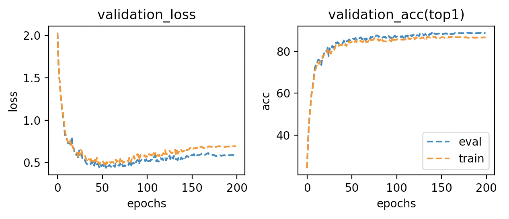
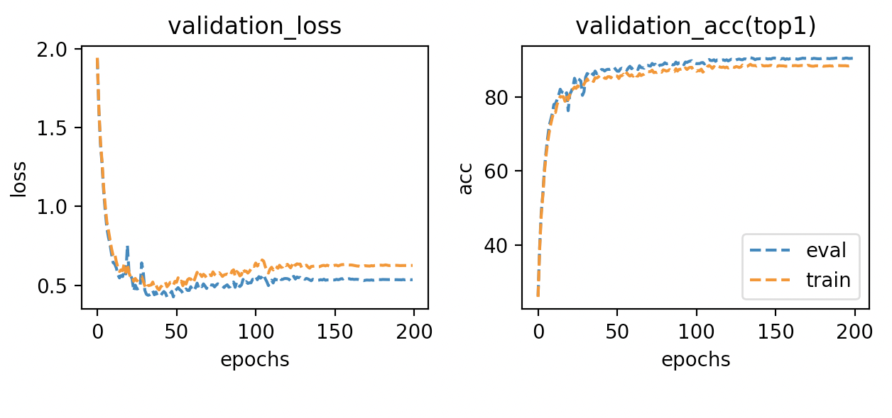
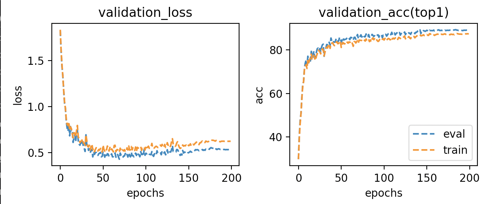
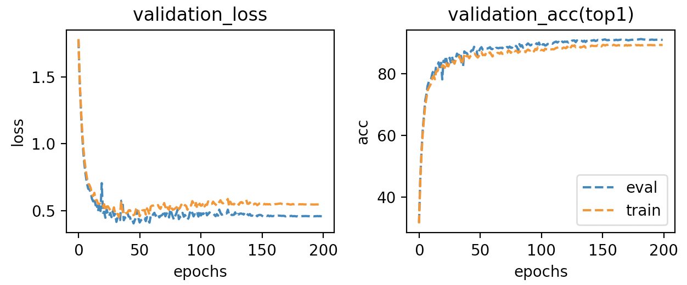
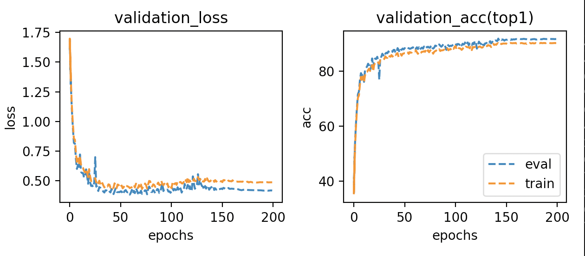
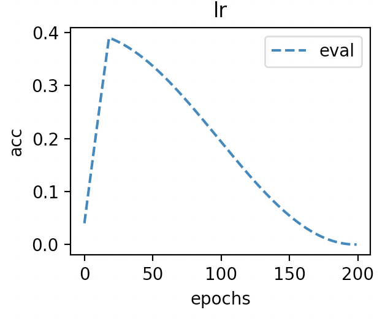
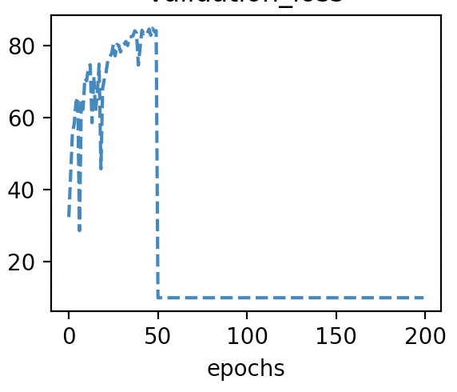

---

typora-copy-images-to: ./pic
---

# Test of different models using diet-gpipe

# Introductions and settings

I use gpipe to test different models and chunks.

## Settings

| Model             | MobileNetV2                                  |
| ----------------- | -------------------------------------------- |
| Dataset           | CIFAR10                                      |
| Training_strategy | train from scratch                           |
| lr_init           | 0.2                                          |
| Batch_size        | 512                                          |
| Chunk             | 4(every batch is splited to 4 micro-batches) |
| Optimizer         | SGD                                          |
| Momentum          | 0.9                                          |
| Weight_decay      | 1e-4                                         |
| Epochs            | 100                                          |
| Scheduler         | cosannealing with linear warp up(20 epochs)  |
| Pruning methods   | None                                         |

## Results

| models      | chunks | accuracy | time per batch |
| ----------- | ------ | -------- | -------------- |
| MobileNetV2 | 1      | 92.79    | 0.52           |
| MobileNetV2 | 2      | 93.14    | 0.37           |
| MobileNetV2 | 4      | 93.09    | 0.29           |
| MobileNetV2 | 8      | 92.94    | 0.26           |
| Resnet18    | 1      | 92.87    | 0.37           |
| Resnet18    | 2      | 92.43    | 0.28           |
| Resnet18    | 4      | 92.78    | 0.25           |
| Resnet18    | 8      | 92.92    | 0.22           |
| VGG11       | 1      | 89.11    | 0.161          |
| VGG11       | 2      | 90.03    | 0.158          |
| VGG11       | 4      | 88.82    | 0.147          |
| VGG11       | 8      | 88.50    | 0.100          |


## code

# Quantization



| Quantization_scalar | 4    |
| ------------------- | ---- |
| learning rate       | 0.1  |



| Quantization_scalar | 8    |
| ------------------- | ---- |
| learning rate       | 0.1  |



| Quantization_scalar | 4    |
| ------------------- | ---- |
| learning rate       | 0.2  |



| Quantization_scalar | 8    |
| ------------------- | ---- |
| learning rate       | 0.2  |



| Quantization_scalar | 8    |
| ------------------- | ---- |
| learning rate       | 0.4  |

Quantization_scalar = 4, lr = 0.4 got nan

Still don't know why.





## usage

```
python3 gpipe_train.py [dataset_dir(already download)] -logdir [log_dir(save log)] --train-type [see partition function] --lr
```

 


