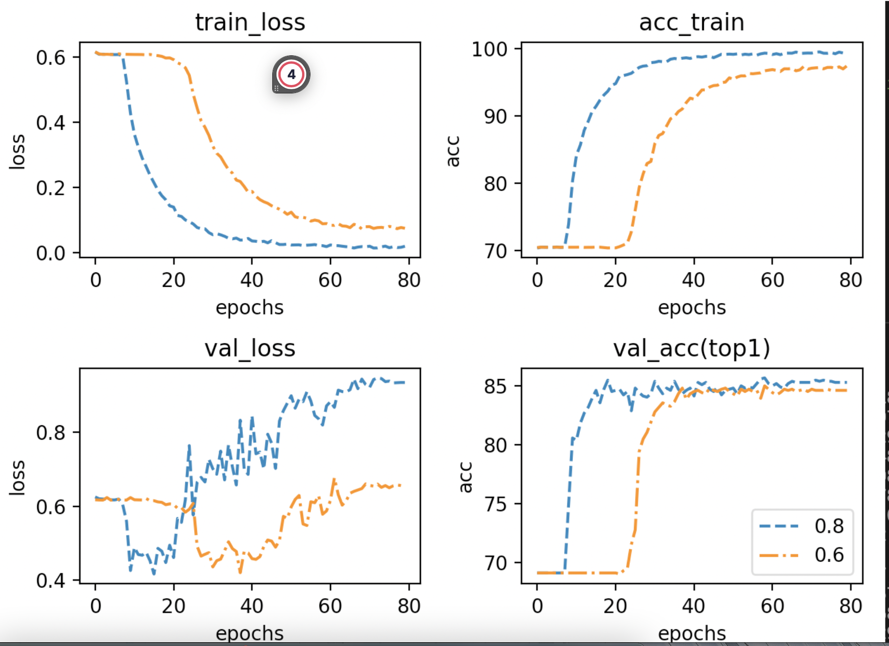

# Some conclusion

## What I have tested

## speed of gpipe

speed up at 4gpu model parallel at least 30% in 4 chunks settings.

```python
        model = md.MobileNetV2()
        layer1 = [model.conv1,model.bn1]
        layer2 = [model.layers[0:3]]
        layer3 = [model.layers[3:7]]
        layer4 = [model.layers[7:],model.conv2]
        layer5 = [model.bn2,Reshape1(), model.linear]
```

## some compression strategy

## pruning(ABS)

It could be set at a high compression ratio when in cv tasks(CIFAR10, CUB200)

0.1-> 3%

However, if the pruning ratio(kept gradients / total gradients) is set too small, performance is truly bad at **rte NLP tasks**

```python
    layer1 = model.roberta.embeddings
    layer2 = nlp_sequential([model.roberta.encoder.layer[0:3]])
    layer3 = nlp_sequential([model.roberta.encoder.layer[3:7]])
    layer4 = nlp_sequential([model.roberta.encoder.layer[7:]])
    layer5 = model.classifier
```


| pruning ratio | Val_acc |
| ------------- | ------- |
| 1(not pruned) | 85.7    |
| 0.8           | 85.5    |
| 0.6           | 85.0    |
| 0.5           | 69.4    |
| 0.4           | 69.4    |

I have tried lr = 2e-5,2e-6,2e-4 on pruning rate = 0.5 and 0.4s which are all unsuccessful.

1. This may be due to me just presenting embedding to the client?

2. This may be due to wrong training settings?

3. From 0.8 to 0.6, we need more epochs to get the best accuracy.

4. pruning rate at 0.4 or below **could get a good train acc but not Val acc**




## quantization

This is the most frustrating part!

In Song Han's paper, he said that using pruning and quantization together will get better results. However, if we prun the gradient by their absolute value, **it is not gonna happen**. Since min and max are not changed. The solution is to implement Huffman code(I don't know how to do it in python:( )

In CV tasks(CIFAR10, CUB200), quantization from 16 to 10 bits could get results within 3% drop out. However, in 8bits quantization, both running mean and simple implementation could get a tremble val curve(but not a training curve).

These methods could release this but not **eliminate the problem!**

1. do not use warmup(not efficient)
2. Use pruning(efficient)

However, in NLP tasks, even **quantization 16** is not possible(get a good training curve but bad value curve)

```txt

step:0  loss_train:0.6158579236196444  acc1_train:70.37687265917603  loss_val:0.6533277942584111  acc1_val:69.13461538461539  time_per_batch:0.181953010041169
step:1  loss_train:0.6084499359968003  acc1_train:70.43539325842697  loss_val:0.652993622651467  acc1_val:69.13461538461539  time_per_batch:0.18329019537579255
step:2  loss_train:0.6090279444633575  acc1_train:70.43539325842697  loss_val:0.6521900493365068  acc1_val:69.13461538461539  time_per_batch:0.1839324017142535
step:3  loss_train:0.6087086659468962  acc1_train:70.43539325842697  loss_val:0.6491002048437412  acc1_val:69.13461538461539  time_per_batch:0.18440750654270585
step:4  loss_train:0.6083497138840429  acc1_train:70.45880149812734  loss_val:0.6503231878464039  acc1_val:69.13461538461539  time_per_batch:0.18464311812254375
step:5  loss_train:0.6078745477208484  acc1_train:70.42368913857678  loss_val:0.6561386940570978  acc1_val:69.13461538461539  time_per_batch:0.18474518895595707
step:6  loss_train:0.607403195675895  acc1_train:70.44709737827715  loss_val:0.6572846458508418  acc1_val:69.13461538461539  time_per_batch:0.18490824806556272
step:7  loss_train:0.6039969723127531  acc1_train:70.45880149812734  loss_val:0.6622396180262933  acc1_val:69.13461538461539  time_per_batch:0.18496277225151492
step:8  loss_train:0.5888707884814074  acc1_train:70.45880149812734  loss_val:0.6693362639500544  acc1_val:69.13461538461539  time_per_batch:0.18487694959961967
step:9  loss_train:0.5379274201296856  acc1_train:71.93352059925094  loss_val:0.6858779402879568  acc1_val:68.46153846153847  time_per_batch:0.18499962935286962
step:10  loss_train:0.4774203706996634  acc1_train:77.22378277153558  loss_val:0.6921224848582195  acc1_val:52.30769230769231  time_per_batch:0.18498387050985843
step:11  loss_train:0.44218309310854376  acc1_train:80.13810861423221  loss_val:0.7019618006852957  acc1_val:31.923076923076923  time_per_batch:0.18481055984782815
step:12  loss_train:0.4132463801111538  acc1_train:81.65964419475655  loss_val:0.7012472019745754  acc1_val:32.59615384615385  time_per_batch:0.1850253990973426
step:13  loss_train:0.384470638051657  acc1_train:83.15777153558052  loss_val:0.7059129918997105  acc1_val:31.057692307692307  time_per_batch:0.18498928225442265
step:14  loss_train:0.36504917027784534  acc1_train:84.53885767790263  loss_val:0.7052472352981567  acc1_val:30.96153846153846  time_per_batch:0.1850060470095288
step:15  loss_train:0.35037142436337493  acc1_train:85.04213483146067  loss_val:0.7123304488567206  acc1_val:30.865384615384617  time_per_batch:0.18498070632920283
step:16  loss_train:0.33803054092675167  acc1_train:85.49859550561797  loss_val:0.7103389675800617  acc1_val:30.865384615384617  time_per_batch:0.1848990810051393
step:17  loss_train:0.3171260793944507  acc1_train:86.97331460674157  loss_val:0.7051494939969136  acc1_val:30.96153846153846  time_per_batch:0.18556241462293188
step:18  loss_train:0.3134954270203894  acc1_train:86.79775280898876  loss_val:0.7072076187683985  acc1_val:30.96153846153846  time_per_batch:0.18526231572869117
step:19  loss_train:0.29121918423268733  acc1_train:87.92134831460675  loss_val:0.7095052762673452  acc1_val:30.865384615384617  time_per_batch:0.185322939233387
step:20  loss_train:0.2762117835009394  acc1_train:88.79915730337079  loss_val:0.7127929256512568  acc1_val:30.865384615384617  time_per_batch:0.18629510036568517
```

Here are my thoughts:

1. I will use torch. half float(16bits float tensor) to train this model
2. I will change model partitions
3. I don't know why:(

## some questions

1. are we focused on internet bandwidth or performance and speed?
2. I can not connect to the server with my laptop and there seem no solutions
3. Pruning has not shortened the tensor we sent(I use the mask to put some elements to 0, do we need to implement PyTorch coo tensor?)
4. Pytorch only provides 8bit and 16 bits tensors, which means 12bits, 10bits, 4bits are not useful.