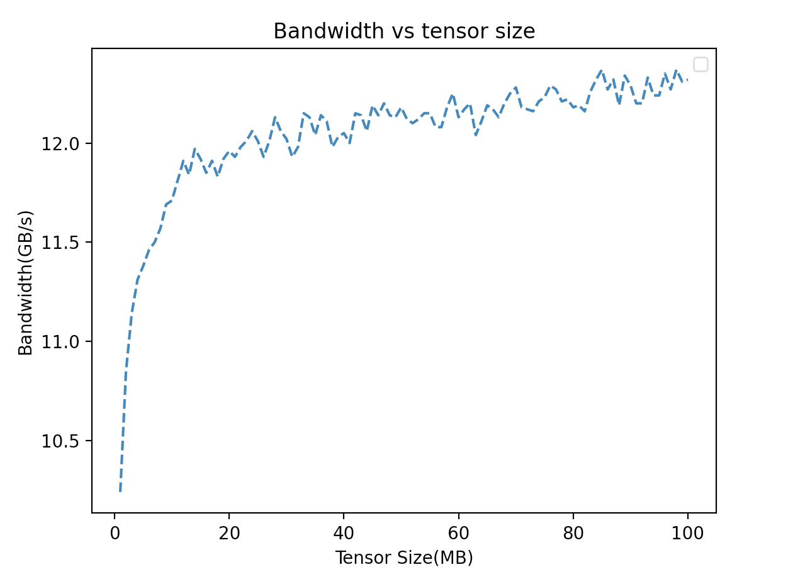

# Bandwidth vs Tensor Size



# Reproduce

First, install and compile nccl.

https://github.com/NVIDIA/nccl

Then install mccl-test

https://github.com/NVIDIA/nccl-tests

Then run the code in terminal

```
./build/sendrecv_perf -b 1M -e 100M -g 2 -d uint8 -n 40 -w 5
```

