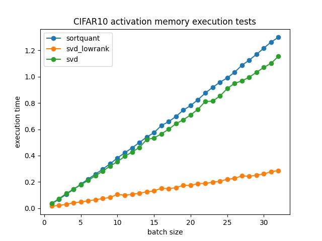
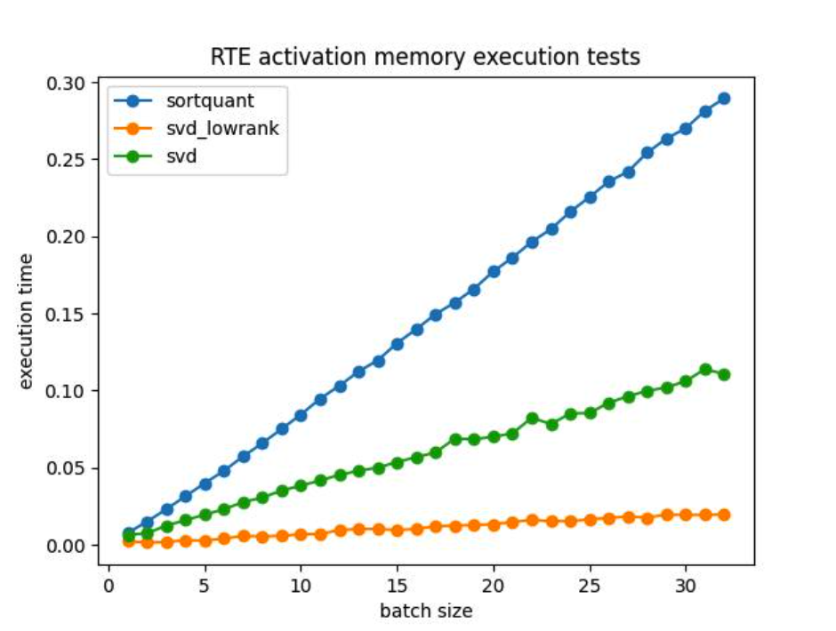
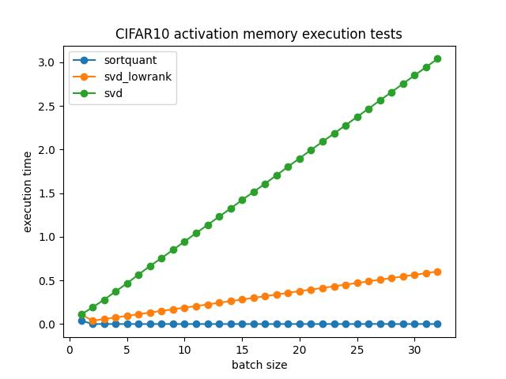

# CPU Training

A simulation by using CPUs to train client tasks and one GTX 1080 to train server tasks

## 1 CIFAR

## 1.1 Settings

| Backend     | Epochs | Lr    | Batch Size |
| ----------- | ------ | ----- | ---------- |
| MoblienetV2 | 40     | 0.005 | 64         |

## 1.2 Results

| Compression method | Chunk | Sever Client Partition  | Throughputs | Validation Acc |
| ------------------ | ----- | ----------------------- | ----------- | -------------- |
| None               | 4     | First layer, last layer | 191.9/s     | 95.92          |
|                    |       |                         |             |                |
|                    |       |                         |             |                |

## 2 Compression Algorithm Analyse

### 2.1 CPU

You can reproduce the results by executing `./CPUtest.py`

#### Settings

| Activation Memory(Total/Batchsize) |
| ---------------------------------- |
| [32,112,112]                       |

### Settings

| Activation Memory(Total/Batchsize) |
| ---------------------------------- |
| [128,768]                          |

## 2.2 GPU

| Activation Memory(Total/Batchsize) |
| ---------------------------------- |
| [32,112,112]                       |

## Settings

| Activation Memory(Total/Batchsize) |
| ---------------------------------- |
| [128,768]                          |

