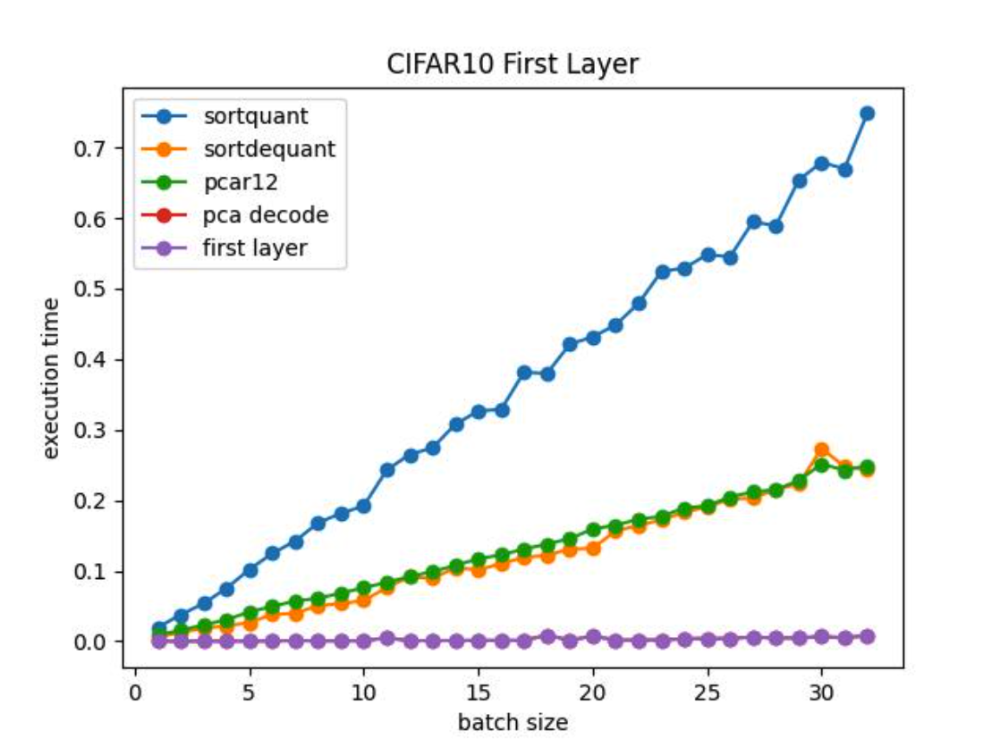
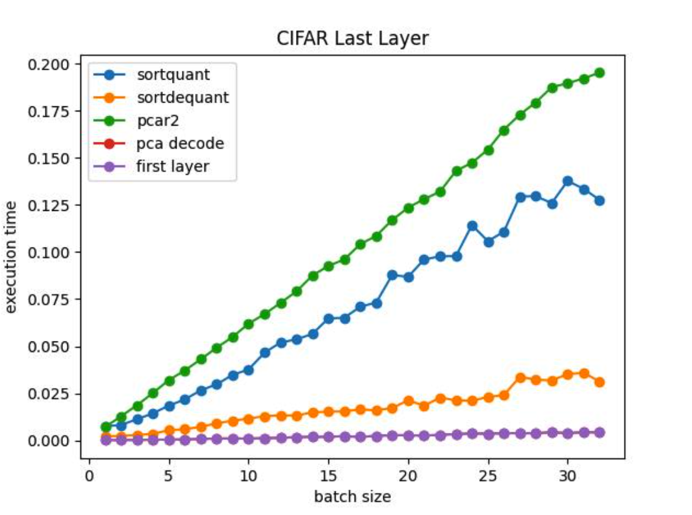
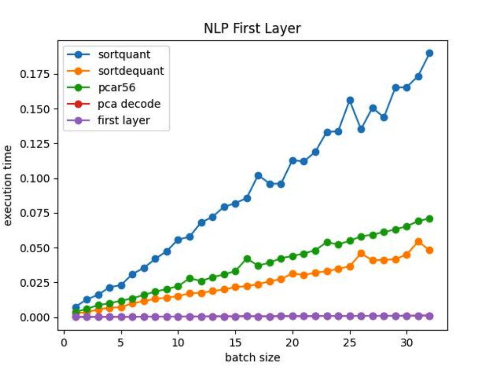
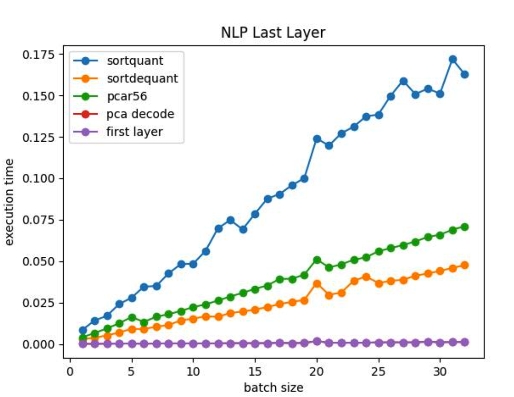
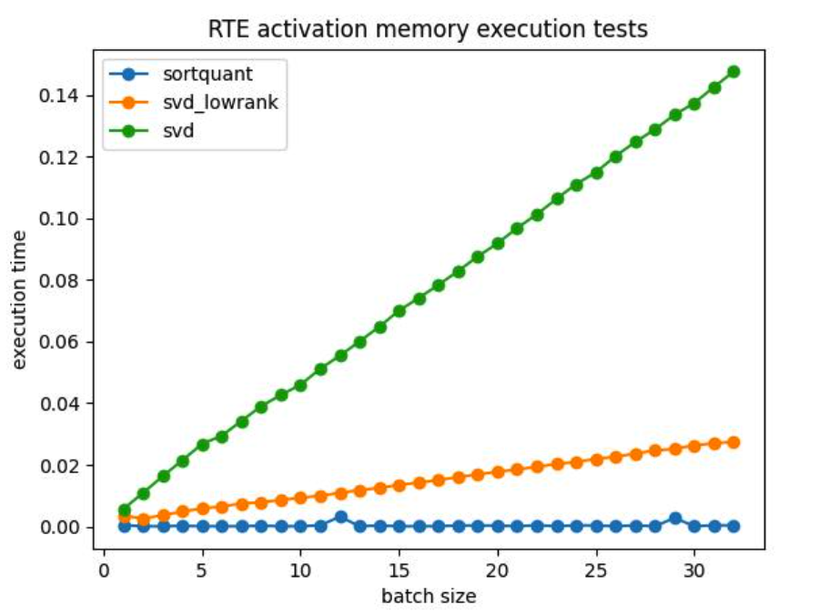

# CPU Training

A simulation by using CPUs to train client tasks and one GTX 1080 to train server tasks

## 1 CIFAR

## 1.1 Settings

| Backend     | Epochs | Lr    | Batch Size |
| ----------- | ------ | ----- | ---------- |
| MoblienetV2 | 40     | 0.005 | 64         |

## 1.2 Results

Here, since CPUs handle SVD faster than GPUs. I perform all PCA encode algorithms in CPUs.

| Hardware(Client,Server) | Compression method      | Chunk | Sever Client Partition  | Throughputs | Validation Acc |
| ----------------------- | ----------------------- | ----- | ----------------------- | ----------- | -------------- |
| CPU,CPU                 | None                    | None  |                         | 32.48/s     | 95.87          |
| Cpu,Gpu                 | None                    | 4     | First layer, last layer | 191.9/s     | 95.92          |
| GPU,GPU                 | None                    | 4     | First layer, last layer | 228.57/s    | 95.89          |
| Cpu,Gpu                 | Sort Quantization 8bits | 8     | First layer, last layer | 41.83/s     | 95.59          |
| Cpu,Gpu                 | PCA 12rank + PCA 2rank  | 8     | First layer, last layer | 40.50/s     |                |

# 2 Compression Algorithm Analyse

## 2.1 CPU

You can reproduce the results by executing `./CPUtest.py`

### Settings

| Activation Memory(Total/Batchsize) |
| ---------------------------------- |
| [32,112,112],[1280,7,7]            |

### Settings

| Activation Memory(Total/Batchsize) |
| ---------------------------------- |
| [128,768]                          |

## 2.2 GPU

| Activation Memory(Total/Batchsize) |
| ---------------------------------- |
| [32,112,112]                       |

### Settings

| Activation Memory(Total/Batchsize) |
| ---------------------------------- |
| [128,768]                          |

