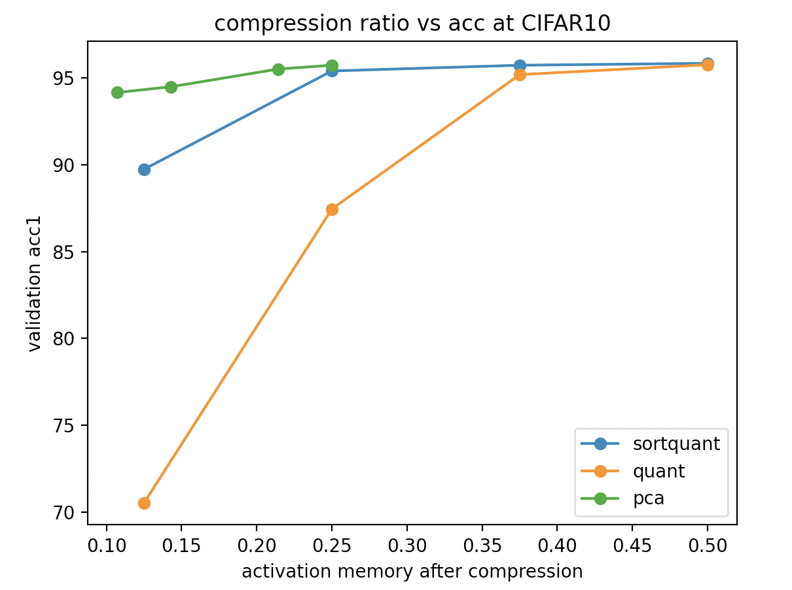
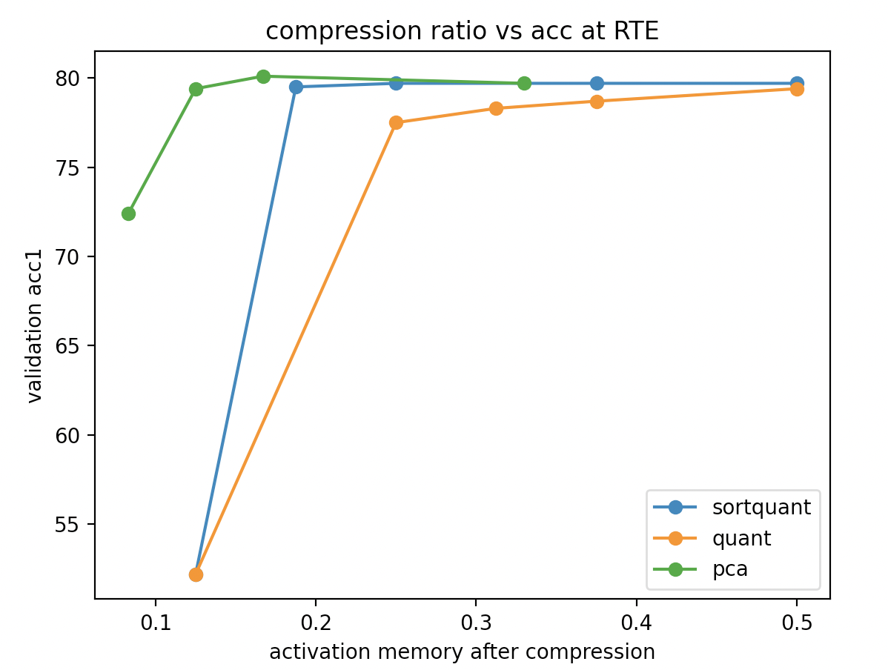

# Compression Algorithm Simulate

All experiments are tested in data-parallelism conditions.

## 1. Result of Uniform Quantization and Pruning

MobilenetV2 CIFAR10

| Training method | Compression method  | Acc%  |
| --------------- | ------------------- | ----- |
| Finetune        | No                  | 96.1% |
| Finetune        | Quantization 16bits | 96.0% |
| Finetune        | Quantization 12bits | 95.4% |
| Finetune        | Quantization 11bits | 91.0% |
| Finetune        | Quantization 10bits | 68%   |
| Finetune        | Quantization 9bits  | 68%   |
| Finetune        | Prune0.5            | 96.1% |
| Finetune        | Prune 0.2           | 95.2% |

NLP tasks with Roberta

| Tasks | Training method | Compression method | Validation_value |
| ----- | --------------- | ------------------ | ---------------- |
| Cola  | Sota            | None               | 0.636            |
| Cola  | Finetune        | None               | 0.645～0.008     |
| Cola  | Finetune        | Prune 0.5          | 0.633～0.013     |
| Cola  | Finetune        | Quantization 16    | 0.632～0.010     |
| Cola  | Finetune        | Quantization 10    | 0.635~0.014      |
| Cola  | Finetune        | Quantization 8     | 0.634~0.001      |
| Cola  | Finetune        | Quantization 4     | 0(acc: 69.1%)    |
| RTE   | Sota            | None               | 78.9%            |
| RTE   | Finetune        | None               | 78.4% ~ 0.6%     |
| RTE   | Finetune        | Prune 0.5          | 79.3%~ 0.7%      |
| RTE   | Finetune        | Quantization 16    | 78.7% ~ 0.7%     |
| RTE   | Finetune        | Quantization 10    | 0.783~1.1%       |
| RTE   | Finetune        | Quantization 8     | 77.5% ~ 0.8%     |
| RTE   | Finetune        | Quantization 4     | 52.2% ~0.1%      |

## 2. Ablation Study of Sort Quantization

Testing CIFAR10 with MobileNetV2 for 80 epochs

| Method                                                       | Input size                            | Acc   |
| ------------------------------------------------------------ | ------------------------------------- | ----- |
| Sort Quantization 4bits(1 split bit)                         | [256,32,112,112]\(first one last one) | 87.1% |
| Sort Quantization 8bits(2 split bits)                        | [256,32,112,112]\(first one last one) | 95.7% |
| Sort Quantization 12bits(3 split bits)                       | [256,32,112,112]\(first one last one) | 95.9% |
| Sort Quantization 16bits(4 split bits)                       | [256,32,112,112]\(first one last one) | 96.1% |
| Sort Quantization 8bits(40 epochs)+Sort Quantization 12bits(40 epochs) | [256,32,112,112]\(first one last one) | 95.7% |

Testing RTE with Roberta for 20 epochs

| Method                                  | Separate Strategy             | Acc   |
| --------------------------------------- | ----------------------------- | ----- |
| Sort Quantization 4bits(2bits 2split)   | firsrt layer, last two layers | 52.2% |
| Sort Quantization 8bits(6bits 2split)   | firsrt layer, last two layers | 79.7% |
| Sort Quantization 12bits(9bits 3split)  | firsrt layer, last two layers | 79.7% |
| Sort Quantization 16bits(12bits 4split) | firsrt layer, last two layers | 79.7% |

## 3 Comparing with PCA

Testing CIFAR10 with MobileNetV2 for 40 epochs

| Method                                                 | Separate Strategy         | Compression Ratio(after/before) | Throughput | Acc   |
| ------------------------------------------------------ | ------------------------- | ------------------------------- | ---------- | ----- |
| SVD 14rank                                             | firsrt layer, last layers | 0.25(only first layer)          | 102.4/s    | 95.73 |
| SVD 12rank                                             | firsrt layer, last layers | 0.214(only first layer)         | 106.2/s    | 95.51 |
| SVD 8rank                                              | firsrt layer, last layers | 0.143(only first layer)         | 125.5/s    | 94.99 |
| SVD 6rank                                              | firsrt layer, last layers | 0.107(only first layer)         | 136.9/s    | 94.16 |
| Sort Quantization 8bits                                | firsrt layer, last layers | 0.25                            | 627.22/s   | 95.73 |
| Sort Quantization 8bits on server SVD 12rank on client | firsrt layer, last layers | 0.214(server) 0.25(client)      | 107.4/s    | 95.48 |

Testing RTE with Roberta-base for 20 epochs. Batch size is 32 

| Method      | Separate Strategy                 | Compression Ratio(after/before) | Throughput | Acc   |
| ----------- | --------------------------------- | ------------------------------- | ---------- | ----- |
| SVD 128rank | firsrt two layer, last two layers | 0.33                            | 54.99/s    | 79.7  |
| SVD 64rank  | firsrt two layer, last two layers | 0.167                           | 60.15/s    | 80.14 |
| SVD 48rank  | firsrt two layer, last two layers | 0.125                           | 62.74/s    | 79.4  |
| SVD 32rank  | firsrt layer, last layers         | 0.083                           | 65.3/s     | 72.4  |

## 4 Comparing with K-means

Testing CIFAR10 with MobileNetV2 for 10 epochs

Could barely use K-means for activation memory compression on four GTX1080.

The batch size here is 64, in order to make it possible for K-means.

| Method                                 | Separate Strategy                      | Throughput | Acc    |
| -------------------------------------- | -------------------------------------- | ---------- | ------ |
| K-means 4bits(20 iter)                 | first three layers and last two layers | 96.96/s    | 93.01% |
| K-means 4bits(50 iter)                 | first three layers and last two layers | 48.12/s    | 93.17% |
| Quantization 4bits                     | first three layers and last two layers | 649.3/s    | 89.42% |
| Sort Quantization 4bits(4splits,2bits) | first three layers and last two layers | 641.4/s    | 93.38% |
| None                                   | first three layers and last two layers | 659.1/s    | 94.21% |

## 5 Lora Implementation

Dataset : CIFAR10

Backend: MobileNetV2

Only compress the first layer

| Method      | Separate Strategy         | Compression Ratio(after/before) | Acc  |
| ----------- | ------------------------- | ------------------------------- | ---- |
| Lora 56rank | firsrt layer, last layers | 0.5                             | 90.3 |

## 6 Convolution Insertion Implementation

MobileNetV2 with CIFAR10

| Method                        | Separate Strategy         | Compression Ratio(after/before) | Acc   |
| ----------------------------- | ------------------------- | ------------------------------- | ----- |
| Convolution insertion         | firsrt layer, last layers | 0.097                           | 96.01 |
| Convolution insertion         | firsrt layer, last layers | 0.070                           | 95.85 |
| Convolution insertion (2sets) | firsrt layer, last layers | 0.038                           | 95.75 |

ResNet18 with CIFAR10

| Method                | Separate Strategy         | Compression Ratio(after/before) | Acc   |
| --------------------- | ------------------------- | ------------------------------- | ----- |
| None                  | Sota                      | 1                               | 96.40 |
| Convolution insertion | firsrt layer, last layers | 0.065                           | 95.79 |

## 7 Different Separation Strategy

### CIFAR10 with MobileNetV2

Compress Algorithm: Uniform Quantization

| Separate Strategy                         | Compression Ratio(after/before) | Acc   |
| ----------------------------------------- | ------------------------------- | ----- |
| First Two Layers, Last Two Layers         | 0.25(8bits)                     | 95.83 |
| First Two Layers, Last Two Layers         | 0.21875(7bits)                  | 95.10 |
| First Layer without Relu, Last Two layers | 0.25(8bits)                     | 91.83 |
| First Layer without Relu, Last Two layers | 0.281(9bits)                    | 94.44 |
| First Layer without Relu, Last Two layers | 0.313(10bits)                   | 95.82 |
| First Layer, Last Two layers              | 0.313(10bits)                   | 86.72 |

## 8 Poweriteration

MobilenetV2 with CIFAR10

Since the activation memory of CV model is 4D, I squeeze it into 3D.  

| Method             | Compression Rate | Separate Strategy                      | Throughput | Acc    |
| ------------------ | ---------------- | -------------------------------------- | ---------- | ------ |
| Power iteration 3D | 0.100            | first layers and last layers           | 581.81/s   | 95.50% |
| Power iteration 3D | 0.073            | first three layers and last two layers | 577.46/s   | 94.75% |

Roberta-base with Cola

| Method             | Compression Rate | Separate Strategy            | Correlation | Acc  |
| ------------------ | ---------------- | ---------------------------- | ----------- | ---- |
| Power iteration 3D | 0.290            | first layers and last layers | 0.653       | 85.6 |
| Power iteration 3D | 0.145            | first layers and last layers | 0.639       | 84.9 |

Roberta-base with RTE

| Method             | Compression Rate | Separate Strategy            | Acc  |
| ------------------ | ---------------- | ---------------------------- | ---- |
| Power iteration 3D | 0.4375           | first layers and last layers | 79.0 |
| Power iteration 3D | 0.290            | first layers and last layers | 77.2 |
| Power iteration 3D | 0.145            | first layers and last layers | 57.6 |

## 9 Half precision training and Mixed precision training

### NLP

Roberta-base with RTE

| Method | Acc   |
| ------ | ----- |
| Fp16   | 77.21 |
| Mixed  | 78.9  |
| Fp32   | 79.1  |

Roberta-base with Cola

| Method | Acc  | Matthew correlation |
| ------ | ---- | ------------------- |
| Fp16   | 84.9 | 0.635               |
| Mixed  | 85.0 | 0.641               |
| Fp32   | 85.2 | 0.648               |
