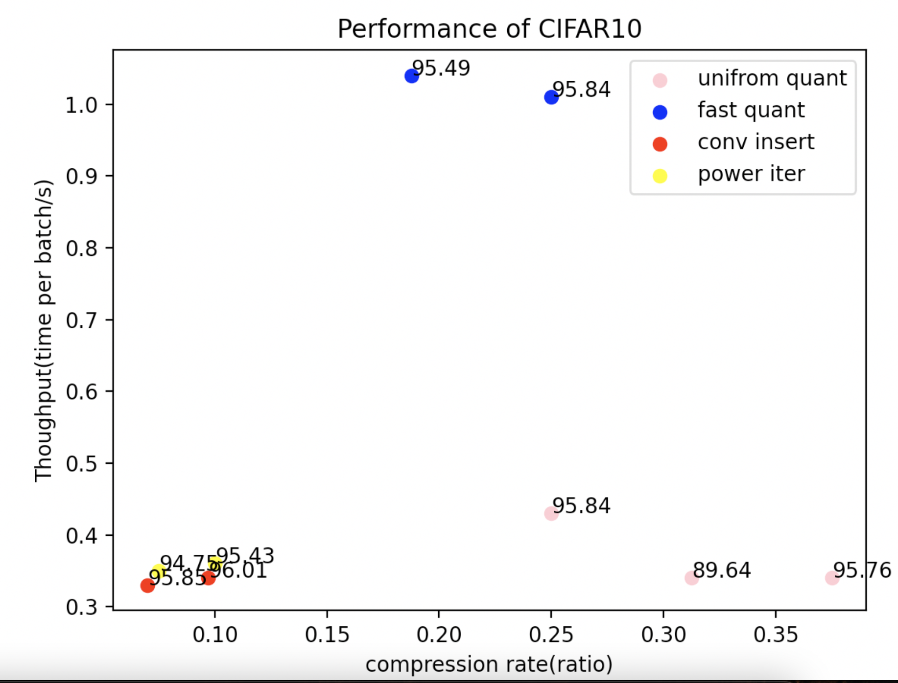

# CPU Training

A simulation by using CPUs to train client tasks and one GTX 1080 to train server tasks

## 1 CIFAR

### 1.1 Settings

| Backend     | Epochs | Lr    | Batch Size |
| ----------- | ------ | ----- | ---------- |
| MoblienetV2 | 40     | 0.005 | 64         |

### 1.2 Results

Here, since CPUs handle SVD faster than GPUs. I perform all PCA encode algorithms in CPUs.

| Hardware(Client,Server) | Compression method         | Chunk | Sever Client Partition          | Bandwidth  | Time  per Batch | Throughputs | Validation Acc |
| ----------------------- | -------------------------- | ----- | ------------------------------- | ---------- | --------------- | ----------- | -------------- |
| CPU(Mac M1)             | None                       | None  | None                            | None       | 6.10s           | 10.49/s     | 95.92          |
| CPU(CPU at server)      | None                       | None  | None                            | None       | 1.97s           | 32.48/s     | 95.87          |
| Cpu,Gpu                 | None                       | 8     | First layer, last layer         | 686.74MB/s | 0.33s           | 191.9/s     | 95.92          |
| GPU,GPU                 | None                       | 8     | First layer, last layer         | 809.38MB/s | 0.28s           | 228.57/s    | 95.89          |
| Cpu,Gpu                 | Sort Quantization 8bits    | 8     | First layer, last layer         | 170.94MB/s | 1.53s           | 41.83/s     | 95.79          |
| Cpu,Gpu                 | Fast Quantization 8bits    | 8     | First layer, last layer         | 170.87MB/s | 1.21s           | 52.89/s     | 95.79          |
| Cpu,Gpu                 | None                       | 8     | First two layer, last two layer | 566.56MB/s | 0.40s           | 160.01/s    | 95.86          |
| Cpu,Gpu                 | Fast Quantization 8bits    | 8     | First two layer, last two layer | 141.64MB/s | 1.01s           | 63.37/s     | 95.84          |
| Cpu,Gpu                 | Uniform Quantization 8bits | 8     | First two layer, last two layer | 142.11MB/s | 0.43s           | 148.84/s    | 95.84          |
| CPu,Gpu                 | Power iteration3d          | 8     | First layer, last layer         | 70.04MB/s  | 0.36s           | 177.78/s    | 95.43          |
| CPu,Gpu                 | Power iteration3d          | 8     | First layer, last layer         | 51.57MB/s  | 0.39s           | 164.10/s    | 94.75          |
| CPu,Gpu                 | Conv Insert                | 8     | First layer, last layer         | 68.70MB/s  | 0.37s           | 172.97/s    | 96.01          |
| CPu,Gpu                 | Conv Insert                | 8     | First layer, last layer         | 48.02MB/s  | 0.36s           | 177.91/s    | 95.85          |
| Cpu,Gpu                 | Conv Insert(2 sets)        | 8     | First layer, last layer         | 25.81MB/s  | 0.41s           | 156.10/s    | 95.70          |

## 2 RTE

CPU can not finetune in fp16 since layernormalization does not allow 16bits training.

Also, full 16bits training cause nan loss when using adam optimizer, and performs badly at RTE dataset.

Mix amplification training may be a good method.

### 2.1 Settings.

| Backend      | Epochs | Lr   | Batch Size |
| ------------ | ------ | ---- | ---------- |
| Roberta-base | 20     | 2e-5 | 32         |

| Sever Client Partition | Explanation                                                  |
| ---------------------- | ------------------------------------------------------------ |
| Condition 1            | Client: embedding+robertalayer(0),robertalayer(11)+classifier Server:robertalayer(1-10) |
| Condition 2            | Client: embedding+selfattention,robertalayer(11)+classifier Server:robertalayer(0-10) |
| Condition 3            | Client: embedding+selfattention,classifier Server:robertalayer(0-11) |

### 2.2 Results

| Hardware(Client,Server) | Compression method         | Chunk | Sever Client Partition | Bandwidth | Time  per Batch | Throughputs | Validation Acc |
| ----------------------- | -------------------------- | ----- | ---------------------- | --------- | --------------- | ----------- | -------------- |
| CPU(Mac M1)             | None                       | None  | None                   | None      | 53.49s          | 0.60/s      | 78.66          |
| CPU,GPU                 | None                       | 4     | Condition 2            | 31.79MB/s | 1.51s           | 21.19/s     | 78.90          |
| CPU,GPU                 | Uniform Quantization 8bits | 4     | Condition 2            | 7.91MB/s  | 1.54s           | 20.78/s     | 78.68          |
| CPU,GPU                 | Uniform Quantization 6bits | 4     | Condition 2            | 5.96MB/s  | 1.54s           | 20.74/s     | 78.40          |
| CPU,GPU                 | Fast Quantization 6bits    | 4     | Condition 2            | 6.04MB/s  | 2.07            | 15.45/s     | 78.90          |
| CPU,GPU                 | Fast Quantization 5bits    | 4     | Condition 2            | 4.93MB/s  | 2.02s           | 15.84/s     | 74.61          |
| CPU,GPU                 | None                       | 4     | Condition 3            | 53.34MB/s | 0.90s           | 35.56/s     | 78.50          |
| CPU,GPU                 | Uniform Quantization 8bits | 4     | Condition 3            | 13.33MB/s | 0.92s           | 34.78/s     | 78.13          |
| CPU,GPU                 | Uniform Quantization 6bits | 4     | Condition 3            | 10.01MB/s | 0.92s           | 34.78/s     | 78.51          |
| CPU,GPU                 | Fast Quantization 5bits    | 4     | Condition 3            | 8.37MB/s  | 1.24s           | 25.80/s     | 74.60          |

## 2 Cola

### 2.1 Settings

| Backend      | Epochs | Lr   | Batch Size |
| ------------ | ------ | ---- | ---------- |
| Roberta-base | 20     | 2e-5 | 32         |

| Sever Client Partition | Explanation                                                  |
| ---------------------- | ------------------------------------------------------------ |
| Condition 1            | Client: embedding+robertalayer(0),robertalayer(11)+classifier Server:robertalayer(1-10) |
| Condition 2            | Client: embedding+selfattention,robertalayer(11)+classifier Server:robertalayer(0-10) |
| Condition 3            | Client: embedding+selfattention,classifier Server:robertalayer(0-11) |

### 2.2 Results

| Hardware(Client,Server) | Compression method      | Chunk | Sever Client Partition | Bandwidth | Time  per Batch | Throughputs | Validation Acc |
| ----------------------- | ----------------------- | ----- | ---------------------- | --------- | --------------- | ----------- | -------------- |
| CPU,GPU                 | Fast Quantization 6bits | 4     | Condition 3            | 10.43MB/s | 0.99s           | 32.32/s     | 84.76          |
| CPU,GPU                 | Fast Quantization 6bits | 4     | Condition 3            | 10.27MB/s | 0.89s           | 35.95/s     | 84.66          |

